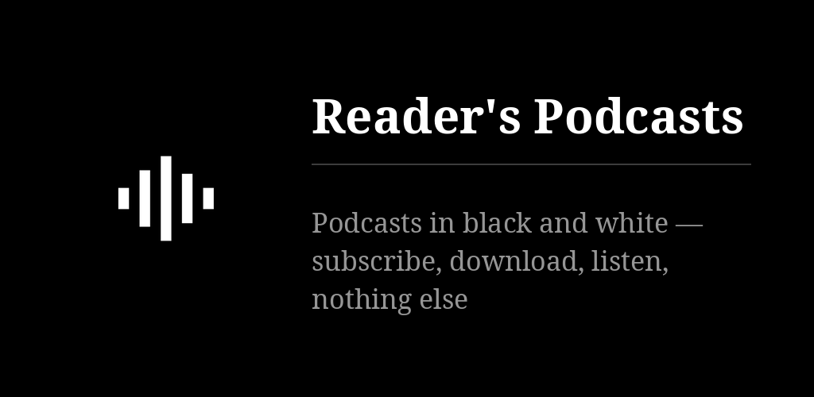
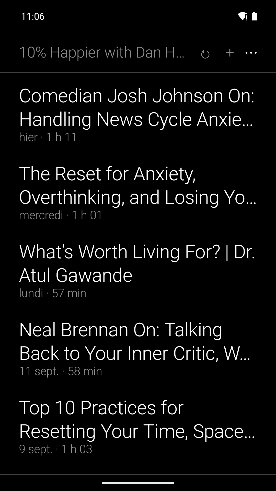
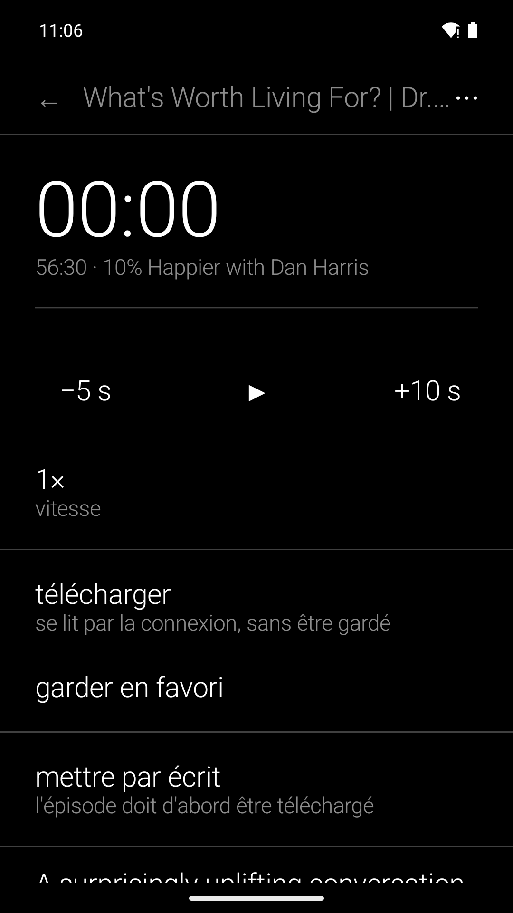

# Reader's Podcasts

Un lecteur de podcasts qui ne montre que du texte : s'abonner, télécharger, écouter avec
reprise. Il met aussi un épisode par écrit et le traduit, sur le téléphone. Ni annuaire, ni
recommandations, ni compte : l'OPML et un fichier de réglages sont toute la synchronisation
avec le [jumeau de bureau](https://github.com/funkypitt/readers-podcasts-desktop).

## Points-clés

* S'abonner : **+** propose l'adresse du presse-papier ; « Ajouter à Reader's Podcasts » est
  dans la feuille de partage de toute app ; un OPML s'importe d'un fichier.
* Quatre listes — chaînes, épisodes, favoris, téléchargés — derrière le ▾ du titre. Tirer vers
  le bas actualise ; dans une chaîne, ↻ n'actualise qu'elle.
* Un appui ouvre l'épisode (notes, liens, chapitres) ; c'est ▶ qui lance l'écoute. Un appui
  long sur un épisode le garde en favori ; un lien se suit d'un appui, se garde d'un appui long.
* Mettre par écrit (whisper, sur le téléphone) : on dit la langue, on choisit l'ordinaire ou la
  soignée, quatre fois plus lente. Le texte suit le son, un appui sur une ligne y envoie
  l'écoute ; il s'exporte en `.txt`.
* Traduire (Gemma 3 4B, sur le téléphone) : demande un téléphone de 8 Go. Les modèles sont
  téléchargés une fois et partagés avec les autres apps Reader's.
* « Effacer une fois écouté » est inactif par défaut ; actif, il épargne les favoris et ce qui
  a été mis par écrit.
* Export/import OPML et JSON (réglages et position de chaque épisode) : c'est la
  synchronisation avec le bureau, sans serveur. Recherche hors connexion.
* Un widget : la dernière écoute et un bouton pour reprendre. Six langues.
* Le réseau ne sert qu'aux flux, aux épisodes et aux modèles. Pas de YouTube dans cette
  version publique : une adresse YouTube y est refusée en toutes lettres.

Plus de détails : [docs/NOTES.md](docs/NOTES.md).

## Installer

Sur [F-Droid](https://funkypitt.github.io/fdroid-repo/repo) et dans les
[releases](https://github.com/funkypitt/readers-podcasts/releases).

## Compiler

    git clone --recursive https://github.com/funkypitt/readers-podcasts.git
    ./gradlew assemblePubliqueRelease   # celui qui se publie
    ./gradlew assemblePriveDebug        # l'APK de travail (YouTube par yt-dlp, GPLv3, non distribué)
    ./gradlew :app:testPriveDebugUnitTest

minSdk 29, targetSdk 34. `speech/` est le sous-module
[readers-speech](https://github.com/funkypitt/readers-speech) ; garder `ndkVersion` dans
`app/build.gradle.kts`, sinon les bibliothèques natives partent non strippées. Licence MIT.

## Captures d'écran

 
